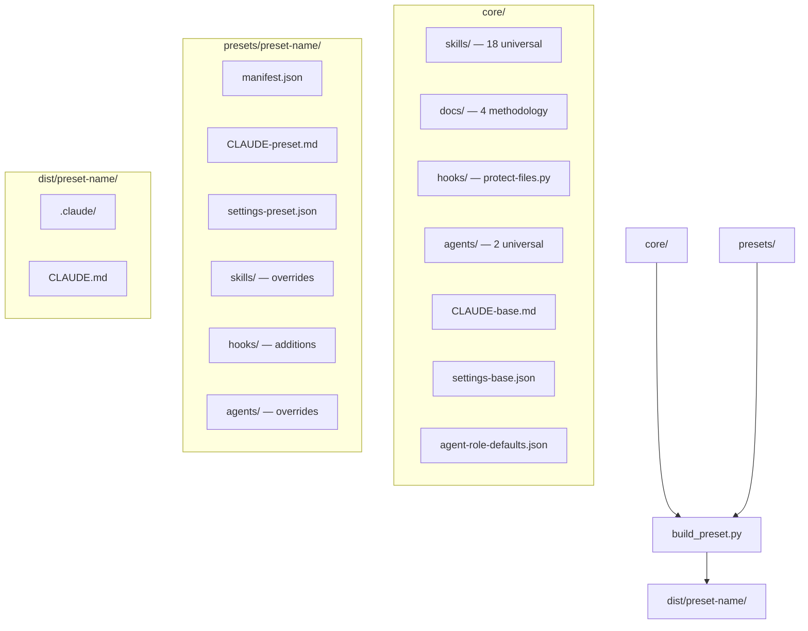
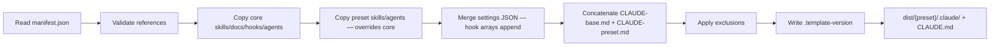
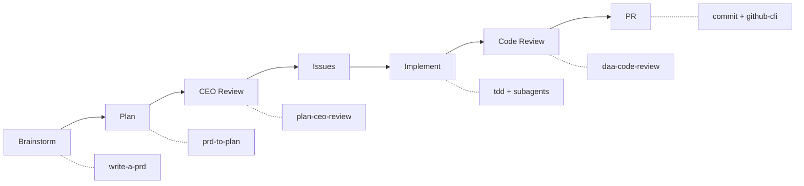

# Claude Workflow

    

A **template system for Claude Code configurations**. Produces ready-to-copy `.claude/` directories and `CLAUDE.md` files for new projects, assembled from a universal skill library and project-type presets.

---

## Table of Contents

- [Overview](#overview)
- [Architecture](#architecture)
  - [High-Level Architecture](#high-level-architecture)
  - [Folder Structure](#folder-structure)
  - [Build Pipeline](#build-pipeline)
- [Getting Started](#getting-started)
  - [Prerequisites](#prerequisites)
  - [Installation](#installation)
  - [Running Tests](#running-tests)
- [Usage](#usage)
  - [Build a Preset](#build-a-preset)
  - [Diff a Project Against a Preset](#diff-a-project-against-a-preset)
  - [Smoke Test a Built Preset](#smoke-test-a-built-preset)
  - [Validate Dev-Cycle State Files](#validate-dev-cycle-state-files)
- [Presets](#presets)
- [Skills](#skills)
  - [Universal Skills (18)](#universal-skills-18)
  - [Preset-Specific Skills](#preset-specific-skills)
- [Agents](#agents)
  - [Core Agents](#core-agents)
  - [Preset Agents](#preset-agents)
  - [Role Defaults](#role-defaults)
- [Methodology](#methodology)
- [Dev-Cycle Orchestrator](#dev-cycle-orchestrator)
  - [7-Phase Pipeline](#7-phase-pipeline)
  - [State Management](#state-management)
- [Troubleshooting](#troubleshooting)
- [Contact](#contact)

---

## Overview

Every new project that uses **Claude Code** needs a `.claude/` directory with skills, hooks, settings, and a `CLAUDE.md` file defining development standards. Setting these up manually is repetitive and error-prone.

**Claude Workflow** solves this with a layered template system:

1. **Core** — 18 universal skills, 2 agents, 4 methodology docs, and a file-protection hook that apply to every project
2. **Presets** — Named configurations (e.g., `python-api`, `full-stack`) that add project-type-specific skills, hooks, and agents
3. **Build tooling** — Python scripts that assemble core + preset into a ready-to-copy `dist/` output

The result is a consistent, tested Claude Code configuration that can be dropped into any new repo in seconds.

---

## Architecture

### High-Level Architecture



### Folder Structure

```
claude-workflow/
├── core/                    # Universal components shared by all presets
│   ├── CLAUDE-base.md       # Base development standards
│   ├── settings-base.json   # Base hook configuration
│   ├── agents/              # 2 universal agents (tdd-implementer, code-reviewer)
│   ├── docs/                # TDD, root-cause tracing, subagent, parallel agents
│   ├── hooks/               # File protection hook
│   ├── agent-role-defaults.json  # Role → skill mapping
│   └── skills/              # 18 universal skills
├── presets/                  # Project-type configurations
│   ├── python-api/          # Python backend services (+ api-builder, security-reviewer)
│   ├── data-pipeline/       # ETL/ELT pipelines (+ pipeline-builder, data-quality-reviewer)
│   ├── full-stack/          # React/Next.js + Python (+ frontend/backend-builder, ux-reviewer)
│   ├── claude-tooling/      # Claude skill/hook development (+ skill-builder, skill-reviewer)
│   └── analysis/            # Notebooks, statistical analysis (+ analysis-builder)
├── scripts/                 # Build, diff, smoke-test, validation tooling
├── tests/                   # 81 pytest tests
├── dist/                    # Build output (gitignored)
├── docs/                    # Plans, archives, dev-cycle state
└── .claude/                 # Self-applicable template (dogfooding)
```

### Build Pipeline



---

## Getting Started

### Prerequisites

- **Python 3.12+**
- **[uv](https://docs.astral.sh/uv/)** — Python package manager
- **Claude Code** — Anthropic's CLI for Claude (to use the built configurations)

### Installation

```bash
git clone https://github.com/cdcoonce/claude-workflow.git
cd claude-workflow
uv sync
```

### Running Tests

```bash
# Run all tests
uv run pytest

# Run with coverage
uv run pytest --cov=scripts --cov-report=term-missing
```

---

## Usage

### Build a Preset

Assemble core + preset into a ready-to-copy output directory:

```bash
uv run python -m scripts.build_preset python-api
```

Output lands in `dist/python-api/`. Copy the `.claude/` directory and `CLAUDE.md` to your target project:

```bash
cp -r dist/python-api/.claude/ /path/to/your-project/.claude/
cp dist/python-api/CLAUDE.md /path/to/your-project/CLAUDE.md
```

### Diff a Project Against a Preset

Check how a project's `.claude/` directory has drifted from the template:

```bash
uv run python -m scripts.diff_preset python-api /path/to/your-project
```

Reports modified, added, and removed files relative to the preset.

### Smoke Test a Built Preset

Validate internal consistency after building:

```bash
uv run python -m scripts.smoke_test python-api
```

Checks that every skill referenced in `CLAUDE.md` has a directory, every hook in `settings.json` exists, and every doc path resolves.

### Validate Dev-Cycle State Files

```bash
uv run python -m scripts.dev_cycle_validate docs/dev-cycle/
```

Validates YAML frontmatter, phase transitions, artifact completeness, and slug uniqueness.

---

## Presets

| Preset               | Target                                  | Preset Skills                | Preset Agents                                        | Key Conventions                            |
| -------------------- | --------------------------------------- | ---------------------------- | ---------------------------------------------------- | ------------------------------------------ |
| **`python-api`**     | Lambda, FastAPI, Flask backends         | `deploy`, `setup-pre-commit` | `api-builder`, `security-reviewer`                   | Ruff linting, structured logging           |
| **`data-pipeline`**  | ETL/ELT, SQL transforms, scheduled jobs | —                            | `pipeline-builder`, `data-quality-reviewer`          | SQL lowercase, idempotent stages           |
| **`full-stack`**     | React/Next.js + Python backend          | `setup-pre-commit`           | `frontend-builder`, `backend-builder`, `ux-reviewer` | Dual test runners, fixture patterns        |
| **`claude-tooling`** | Claude skills, hooks, agents            | —                            | `skill-builder`, `skill-reviewer`                    | Skill structure requirements               |
| **`analysis`**       | Notebooks, R/Python scripts             | —                            | `analysis-builder`                                   | Reproducible seeds, documented assumptions |

Each preset's `manifest.json` controls which core components to include, which to exclude, and what preset-specific overrides to layer on top.

---

## Skills

### Universal Skills (18)

These ship with every preset:

| Skill                            | Trigger                             | Description                                   |
| -------------------------------- | ----------------------------------- | --------------------------------------------- |
| `/daa-code-review`               | "code review", "quality check"      | Python, Markdown, and Mermaid analysis        |
| `/commit`                        | "commit", "save work"               | Conventional commit style enforcement         |
| `/design-an-interface`           | "design it twice", API design       | Parallel sub-agents for interface comparison  |
| `/dev-cycle`                     | "dev cycle", "development workflow" | Full 7-phase GitHub-issues-driven pipeline    |
| `/github-cli`                    | GitHub operations                   | Issues, PRs, branches, reviews via `gh`       |
| `/grill-me`                      | "grill me", stress-test a plan      | Systematic interrogation via AskUserQuestion  |
| `/improve-codebase-architecture` | architecture improvement            | Deep-module refactoring opportunities         |
| `/plan-ceo-review`               | "CEO review", "mega review"         | 3-mode plan review (expand/hold/reduce scope) |
| `/prd-to-issues`                 | "convert PRD to issues"             | Vertical-slice GitHub issue creation          |
| `/prd-to-plan`                   | "break down PRD", "tracer bullets"  | Multi-phase implementation planning           |
| `/project-context`               | "update project.md"                 | Generate `.claude/docs/project.md`            |
| `/readme-generator`              | "README", "document this project"   | Codebase analysis + README generation         |
| `/request-refactor-plan`         | "plan a refactor"                   | Tiny-commit refactor RFC as GitHub issue      |
| `/tdd`                           | "red-green-refactor", TDD           | Test-driven development loop                  |
| `/triage-issue`                  | "triage", bug report                | Root-cause investigation + issue creation     |
| `/write-a-prd`                   | "write a PRD"                       | Interview-driven PRD as GitHub issue          |
| `/write-a-skill`                 | "create a skill"                    | Skill authoring with proper structure         |

### Preset-Specific Skills

| Preset                     | Skill               | Description                       |
| -------------------------- | ------------------- | --------------------------------- |
| `python-api`               | `/deploy`           | Lambda/service deployment         |
| `python-api`, `full-stack` | `/setup-pre-commit` | Husky + lint-staged configuration |

---

## Agents

Agents are specialized role definitions (`AGENT.md` with YAML frontmatter) that give subagents domain expertise. Each agent declares a **role** (`implementer` or `reviewer`) and can customize which skills it carries.

### Core Agents

These ship with every preset:

| Agent                 | Role          | Skills            | Description                                      |
| --------------------- | ------------- | ----------------- | ------------------------------------------------ |
| **`tdd-implementer`** | `implementer` | `tdd`, `commit`   | Implements features using red-green-refactor TDD |
| **`code-reviewer`**   | `reviewer`    | `daa-code-review` | Reviews code for quality, structure, correctness |

### Preset Agents

Each preset adds domain-specific agents that override or extend the core set:

| Preset           | Agent                       | Role          | Description                          |
| ---------------- | --------------------------- | ------------- | ------------------------------------ |
| `python-api`     | **`api-builder`**           | `implementer` | FastAPI/Flask/Lambda specialist      |
| `python-api`     | **`security-reviewer`**     | `reviewer`    | Security-focused code review         |
| `data-pipeline`  | **`pipeline-builder`**      | `implementer` | ETL/ELT pipeline construction        |
| `data-pipeline`  | **`data-quality-reviewer`** | `reviewer`    | Data validation and quality review   |
| `full-stack`     | **`frontend-builder`**      | `implementer` | React/Next.js frontend development   |
| `full-stack`     | **`backend-builder`**       | `implementer` | Python backend API development       |
| `full-stack`     | **`ux-reviewer`**           | `reviewer`    | UX and accessibility review          |
| `claude-tooling` | **`skill-builder`**         | `implementer` | Claude skill/hook/MCP development    |
| `claude-tooling` | **`skill-reviewer`**        | `reviewer`    | Skill correctness and best practices |
| `analysis`       | **`analysis-builder`**      | `implementer` | Data analysis and notebook workflows |

### Role Defaults

`core/agent-role-defaults.json` defines the base skill set per role. Individual agents can override via `skills.add` and `skills.remove` in their YAML frontmatter.

```json
{
  "implementer": { "skills": ["tdd", "commit"] },
  "reviewer": { "skills": ["daa-code-review"] }
}
```

A preset agent with the same name as a core agent **replaces** it (override semantics, not merge).

---

## Methodology

Four methodology documents in `core/docs/` define how Claude Code agents should work:

| Methodology              | Core Principle                                                               |
| ------------------------ | ---------------------------------------------------------------------------- |
| **TDD**                  | Write the test first. Watch it fail. Write minimal code to pass.             |
| **Root Cause Tracing**   | Never fix at the symptom. Trace backward to the original trigger.            |
| **Subagent Development** | Dispatch a fresh subagent per task with code review between each.            |
| **Parallel Agents**      | When 3+ unrelated failures need investigation, one agent per problem domain. |

---

## Dev-Cycle Orchestrator

The `/dev-cycle` skill orchestrates end-to-end feature development through GitHub issues.

### 7-Phase Pipeline



Every phase is mandatory. Each phase gates on a specific artifact (issue URL, plan file, approval, etc.) before advancing.

### State Management

- **State files** live at `docs/dev-cycle/{slug}.state.md` with YAML frontmatter
- **Resume** across conversations — scan for `status: in_progress` files
- **Archive** on completion — `git mv` state + plan files to `docs/archive/`
- **Backwards transitions** supported: `implement → plan` or `code_review → plan` when architectural issues arise

---

## Troubleshooting

| Symptom                                        | Likely Cause                                                                            | Fix                                                                    |
| ---------------------------------------------- | --------------------------------------------------------------------------------------- | ---------------------------------------------------------------------- |
| `build_preset.py` fails with "skill not found" | Manifest references a skill that doesn't exist in `core/skills/` or `presets/*/skills/` | Check `manifest.json` `preset_skills` array against actual directories |
| Smoke test reports missing hook                | Hook listed in `settings.json` but file not in `.claude/hooks/`                         | Add the hook file or remove from settings                              |
| `diff_preset.py` shows unexpected changes      | Project has drifted from template                                                       | Review diff output; re-build and re-copy if desired                    |
| Dev-cycle state file validation fails          | Frontmatter schema mismatch or phase transition error                                   | Check `schema_version: 1` and that phases follow strict order          |
| macOS "` 2`" duplicate files appear            | Prettier hook reformats files, then `git checkout` conflicts                            | Already mitigated via `.prettierrc` + `.gitignore` patterns            |

---

## Contact

For questions or support, contact:

- **Charles Coonce** — charlescoonce@gmail.com
