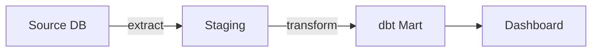
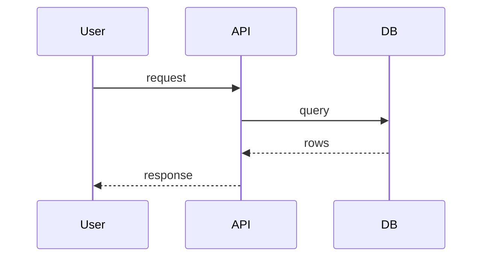
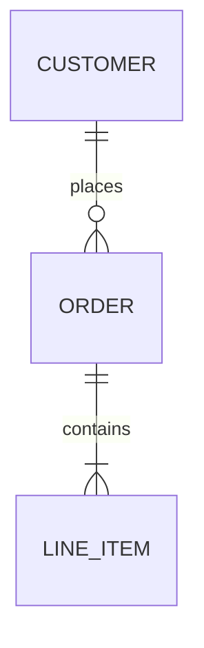

# Mermaid Generation Guide

Mermaid is text-first diagramming: the diagram lives as code in a fenced ` ```mermaid `
block and renders inline on GitHub, GitLab, Obsidian, and most markdown viewers. It is
the default engine for anything that lives in documentation, because it diffs cleanly and
needs no external tool.

## Diagram types — pick the right one

| Need | Type | Header |
|------|------|--------|
| Architecture, dependencies, data flow | flow graph | `graph TD` / `graph LR` |
| Decision tree, process with branches | flowchart | `flowchart TD` |
| "What happens when…" request/response | sequence | `sequenceDiagram` |
| Entity with states + transitions | state machine | `stateDiagram-v2` |
| Data model / table relationships | ERD | `erDiagram` |
| Time-ordered milestones | timeline | `timeline` or `gantt` |
| Class structure | class diagram | `classDiagram` |

`TD` = top-down, `LR` = left-right. Use `LR` for wide pipelines, `TD` for hierarchies.

## Best practices

- **One diagram, one idea.** If a diagram passes ~15 nodes, split it. Several focused
  diagrams beat one dense everything-map.
- **Use subgraphs** to group related components: `subgraph "Database Layer" ... end`.
- **Label every edge** — `A -->|"raw data"| B` is far more useful than `A --> B`.
- **Descriptive node labels** — `SF["Snowflake Warehouse"]`, not bare `SF`.
- **Avoid reserved words as node IDs** — `end`, `class`, `subgraph` break parsing; use
  `endNode` etc.
- **Quote labels with special characters** — parentheses, slashes, and colons need
  `["..."]` wrapping or they break the parser.

## Examples

Architecture / data flow:


Sequence:


ERD:


## Choosing how many, by project type

(Guidance for docs that bundle multiple diagrams — e.g. READMEs.)

- **Data pipeline** → 4-6: architecture, data flow, run sequence, module dependencies,
  validation/quality flow, orchestration/scheduling.
- **Web app** → 3-5: architecture, key request flow, CI/CD, UI/section layout.
- **CLI tool** → 2-4: architecture, command flow, config resolution.

Don't hold back — if a diagram helps someone understand something, include it.
